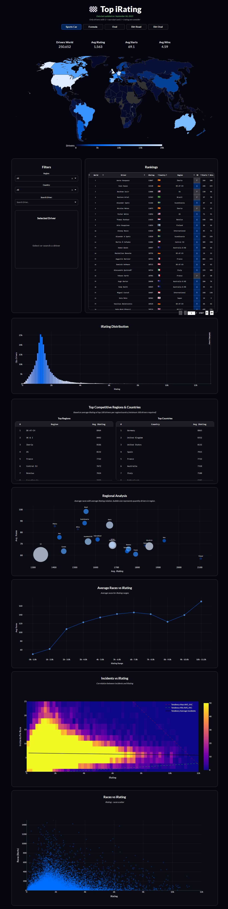

# 🏁 iRacing Dashboard

An interactive web dashboard designed to visualize and analyze iRating data from the racing simulator, iRacing.com. This tool provides a comprehensive overview of driver performance across different disciplines, regions, and countries, this features are not implemented on the simulator yet

🚀 **Live Demo:** [**daniel-saed-top-irating.hf.space**](https://daniel-saed-top-irating.hf.space/)

---

## 📸 Screenshots

**Main Dashboard View (Map & Filters)**

---

## ✨ Features

*   **Global iRating Rankings:** View and sort top drivers by iRating in various racing disciplines (Road, Oval, Dirt, etc.).
*   **Interactive World Map:** Visualize the global distribution of drivers, with colors indicating the density of talent.
*   **Advanced Filtering:** Easily filter the entire dataset by discipline, region (e.g., Europe, North America), or a specific country.
*   **Driver Search:** Quickly find any driver in the database to see their stats and rank.
*   **In-Depth Analytics:** Explore various charts that show:
    *   iRating distribution across the entire driver population.
    *   The most competitive regions and countries.
    *   The relationship between iRating, safety (incidents), and experience (races started).

---

## 📊 Data Source & Automation

The data for this dashboard is sourced directly from the **official iRacing data API**.

To ensure the data remains current, a **GitHub Actions** workflow is configured to run automatically on a schedule. This automated process:
1.  Fetches the latest driver statistics from the iRacing API.
2.  Processes and cleans the data for each racing discipline.
3.  Commits the updated data files back to this GitHub repository.

This system guarantees that the dashboard always reflects recent iRacing activity without requiring any manual intervention.

---

## 🛠️ Tech Stack

This dashboard was built using a modern, data-centric Python stack:

*   **Backend & Web Framework:** [Plotly Dash](https://dash.plotly.com/)
*   **Data Manipulation:** [Pandas](https://pandas.pydata.org/) & [NumPy](https://numpy.org/)
*   **Data Visualization:** [Plotly Express](https://plotly.com/python/plotly-express/)
*   **Web Server:** [Gunicorn](https://gunicorn.org/)
*   **Automation:** [GitHub Actions](https://github.com/features/actions) for scheduled data fetching from the iRacing API.
*   **Deployment:** [Hugging Face Spaces](https://huggingface.co/spaces) with [Docker](https://www.docker.com/).
